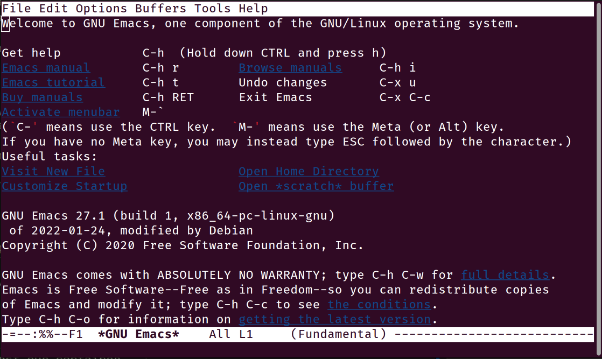

.. note::
    This document describes the routine usage of the Mezzotint tool.

Detailed Usage
==============

Beyond the rapid and automated execution of Mezzotint, there exists a more sophisticated and precise approach utilizing `Profiles`. Profiles come to the rescue when automated data collection is simply not sufficient and may not always yield the most optimal results, leaving residual artifacts that still could safely be removed.

Every container (or intended App Bundle) necessitates a corresponding Profile. These Profiles can delineate specific container details, thereby reducing the number of command-line arguments required.

Provisioning a Base Container
--------------------------------

There is no limitations with what kind of tooling one should provision a container. However, in current workflow it is recommended to use `Buildah <https://buildah.io>`__ — a tool that facilitates building Open Container Initiative (OCI) container images.

Provisioning a container from a package-based distribution can vary across different distributions. This specific document outlines the process using Ubuntu 22.04 LTS, yet the procedure should remain largely consistent across other versions of Ubuntu or Debian.

To provision a base root filesystem, Debian is using `debootstrap <https://linux.die.net/man/8/debootstrap>`__ utility withing a container from scratch, using Buildah as following:

.. code-block:: shell

    # Allocate a name for a container
    # and create an empty one
    C_NAME=$(buildah from scratch)

    # Mount a new container and catch the mount point
    C_MNT=$(buildah mount $C_NAME)

In this case ``C_NAME`` will contain a container name, usually defaults to `"working-container"`. The variable ``C_MNT`` contains the full path to the mount point. At this point it is a time to provision that container, using ``debootstrap`` utility, passing it the mount point path as following:

.. code-block:: shell

    # Run debootstrap, installing the most minimal base system
    debootstrap --variant=minbase jammy $C_MNT

It will require some time to complete. Once finished, you'll be able to use this mount point essentially as a container.

Adding Software
---------------

The root filesystem setup is now finished, but it's quite minimal, only including the ``main`` repository. To install applications like Emacs editor, additional repositories need to be configured:

.. code-block:: shell

    echo -e "deb http://de.archive.ubuntu.com/ubuntu jammy main universe multiverse restricted\n" >> $MNT/etc/apt/sources.list

Although it's possible to run this root filesystem as a container and begin installations within it, this document employs an ``old-school`` approach of simply changing the root (which is also functional) as follows:

.. code-block:: shell

    chroot $C_MNT apt update
    chroot $C_MNT apt install -y emacs-nox

At this stage, the Emacs editor will be installed onto the target image. Following these steps, all essential customizations, including the addition of extra scripts, need to be completed.

We can now refer to the container as the "original" or "source." To expedite processes, it's recommended to push this container to the local registry on localhost:

.. code-block:: shell

    buildah commit $C_NAME my_emacs

So now this is the situation where:

- There exists a functional Emacs container in the local registry, enabling restoration without repeating provisioning, bootstrapping, or configurations.
- Additionally, the mount point remains accessible through the variable ``$C_MNT``.

We will proceed using the mount point for further actions.

Profile Definition
------------------

To minimize a container's artifacts, defining a Profile is essential. These Profiles are YAML files with any chosen name, passed to Mezzotint using ``--profile`` or ``-p`` option.

Targets
^^^^^^^

`Targets` consist of a list of absolute paths pointing to the executables within a container. They are defined as follows:

.. code-block:: yaml

    targets:
        - /usr/bin/vim
        - /usr/bin/my-other-app

Packages
^^^^^^^^

`Packages` section is a list of known packages, those content should be preserved. This is for the situation when a package has no direct link to the software package, because software package assumes the artifacts are always there anyway.

.. attention::

    The content of those packages will be still examined for a possible "junk", such as text files, manpages and similar content.

An example of packages section:

.. code-block:: yaml

    packages:
        - bash
        - apt
        - binutils

Configuration
^^^^^^^^^^^^^

Filtering configuration contains various flags of their `types`, determining what needs to be left on the disk and what needs to be removed. This section also contains list of what files needs to be removed or explicitly preserved, even they are marked as unnecessary.

Filters
"""""""

.. code-block:: yaml

    filters:
        - <NAME>

This is the list of filter names:

l10n
    Match any kind of localisation files

i18n
    Match internationalisation files

doc
    Matches all possible documentation, licenses, howtos etc

man
    Match all manpages on the file system

log
    Matches logfiles

dir
    Matches empty directories or directories with empty subdirectories

pic
    Matches any graphics data (images, pictures, pictograms, vector data etc)

arc
    Matches any kind of archives (tarballs, zip archives etc)

all
    Replaces all above. If you want to use all the filters listed above, simply use this one instead

Data removal
""""""""""""

Some specific paths that were not automatically detected as not needed, still can be explicitly scheduled for the removal. This is used in the section ``prune``, which is just a list of paths with (optionally) Unix globbing:

.. code-block:: yaml

    prune:
        - /usr/share/bug/*
        - /usr/share/lintian/*

Data preservation
"""""""""""""""""

Data preservation works the same way as in the chapter "Date removal", just in the section ``keep``. For example:

.. code-block:: yaml

    keep:
        - /etc
        - /usr/bin/*

Scripting Hooks
"""""""""""""""

Hooks are basic commands, but can be also a proper shell scripts with the shebang. There are two types of hooks:

- Before
- After

Example:

.. code-block:: yaml

    hooks:
        before: |
            echo "Hello"

        after: |
            echo "Bye"

In a nutshell, one can run a script before and after `calculation` of what junk is.

.. attention::

    In both cases `before` and `after`, hooks are always called **before the actual data removal**, because there is no guarantee that the very runtime of the script will not be removed and thus fail to run the script. That is, `before` hook is running right before Mezzotint is calculating what data needs to be removed etc.

Profile Example
---------------

This would be a basic profile for Emacs without X11 support (terminal only):

.. code-block:: yaml

    targets:
        - /usr/bin/emacs-nox

    packages:
        - ncurses-base
        - emacs-common

    config:
        filters:
            - all

    hooks:
        # Vim users will enjoy this for sure
        after: |
            ln -s /usr/bin/emacs-nox /usr/bin/vim

Running Mezzotint with a Profile
--------------------------------

If the profile is ready, first it would be a very good idea to see what will be at the end and gather some statistics. To do so, first let's run it in dry-run without applying the changes, using ``--dry-run`` or ``-t`` flags:

.. code-block:: shell

    mezzotint --dry-run --profile <PROFILE> -r <PATH_TO_ROOTFS>

For example, if your working container is currently mounted as ``/var/tmp/mycontainer`` then:

.. code-block:: shell

    mezzotint -t -p mycontainer.yaml -r /var/tmp/mycontainer

This will perform an excessive output to the terminal, listing all directories and files that will be preserved, calculating their size etc. At the end Mezzotint will print the total results, like how much disk space will be freed and how much space preserved etc. Also Mezzotint will print the list of preserved packages.

For example:

.. code-block:: text

    /usr/share/emacs/27.1/site-lisp
    ──┬──┄┄╌╌ ╌  ╌
      ╰─ subdirs.el
    Files: 1, Size: 19.4 KB

    /usr/share/emacs/site-lisp
    ──┬──┄┄╌╌ ╌  ╌
      ╰─ subdirs.el
    Files: 1, Size: 106 B

    /usr/share/lintian/overrides
    ──┬──┄┄╌╌ ╌  ╌
      ├─ emacs-nox
      ╰─ ncurses-base
    Files: 2, Size: 229 B

    /usr/share/tabset
    ──┬──┄┄╌╌ ╌  ╌
      ├─ std
      ├─ stdcrt
      ├─ vt100
      ╰─ vt300
    Files: 4, Size: 628 B

    Removed 6781 files, releasing 346.2 MB of a disk space
    Preserved 1902 files, taking 182.4 MB of a disk space
    Potentially 22 junk files, taking 2.2 MB of a disk space
    Kept 34 packages as follows:
    emacs-common, emacs-nox, libacl1, libasound2, libc6, libcap2,
        libdbus-1-3, libffi8, libgcc-s1, libgcrypt20, libgmp10,
        libgnutls30, libgpg-error0, libgpm2, libhogweed6, libicu70,
        libidn2-0, libjansson4, liblcms2-2, liblz4-1, liblzma5,
        libnettle8, libp11-kit0, libpcre2-8-0, libselinux1,
        libstdc++6, libsystemd0, libtasn1-6, libtinfo6, libunistring2,
        libxml2, libzstd1, ncurses-base, zlib1g

    [23/09/2023 12:40:17] - WARN: This was a dry-run. Changes were not applied.

If you compare with the output captured in a chapter ":doc:`/quickstart`", you will notice that automatic resolver still left some more data on the disk, which might be not the most optimal solution.

The output also found additional 22 junk files. Scrolling this output, they are revealed with alert icon, like so:

.. code-block:: text

    /usr/share/emacs/27.1/etc
    ──┬──┄┄╌╌ ╌  ╌
      ├─ ⚠️  CALC-NEWS
      ├─ ⚠️  ERC-NEWS
      ├─ ⚠️  ETAGS.EBNF
      ├─ ⚠️  HELLO
      ├─ ⚠️  MACHINES
      ├─ ⚠️  MH-E-NEWS
      ├─ ⚠️  NEWS
      ├─ ⚠️  NEWS.1-17
      ├─ ⚠️  NEWS.18
      ├─ ⚠️  NEWS.19
      ├─ ⚠️  NEWS.20
      ├─ ⚠️  NEWS.21
      ├─ ⚠️  NEWS.22
      ├─ ⚠️  NEWS.23
      ├─ ⚠️  NEWS.24
      ├─ ⚠️  NEWS.25
      ├─ ⚠️  NEWS.26
      ├─ ⚠️  NEXTSTEP
      ├─ ⚠️  NXML-NEWS
      ├─ ⚠️  ORG-NEWS
      ╰─ ⚠️  PROBLEMS
    Files: 21, Size: 12.2 MB

These files are occupying 12 megabytes without any kind of practical need. You can choose either to keep these or you can do something about it. One way is to let Mezzotint deal with it, using ``--autodeps`` option with flag ``tight``. This flag tells Mezzotint to actually not to look for dependencies, but only make a container "tight", i.e. remove all data that is considered not important:

.. code-block:: shell

    mezzotint -a tight -t -p mycontainer.yaml -r /var/tmp/mycontainer

This operation will additionally shave off 12Mb from this container. Now it is a time to actually apply the changes.

.. danger::

    Once changes are applied, the operation cannot be undone!

For the reasons that the operation cannot be undone while the entire container might be permanently damaged for different reasons like wrong/incomplete profile, missing packages etc, it is recommended to pre-commit "fat" finished container to the local storage and restore working container from it, using Buildah.

To apply the changes, simply remove ``--dry-run`` or ``-t`` flag, and re-run Mezzotint:

.. code-block:: shell

    mezzotint -a tight -p mycontainer.yaml -r /var/tmp/mycontainer

You should be seeing the following output:

.. code-block:: text

    [23/09/2023 13:01:30] - INFO: Launching scanner and data processor
    [23/09/2023 13:01:30] - INFO: Getting profile at profile.yaml
    [23/09/2023 13:01:31] - INFO: Automatically removing potential junk resources
    [23/09/2023 13:01:31] - INFO: Finished. Hopefully it even works :-)

At this point, if you navigate to ``/var/tmp/mycontainer`` and list it, you will see that the root filesystem is significantly smaller than usual:

.. code-block:: text

    -rw-r--r-- 1 root root    0 Sep 23 13:01 .tinted.lock
    lrwxrwxrwx 1 root root    7 Sep  9 15:28 bin -> usr/bin
    drwxr-xr-x 1 root root   79 Sep 23 13:01 dev
    drwxr-xr-x 1 root root 4.0K Sep 23 13:01 etc
    lrwxrwxrwx 1 root root    7 Sep  9 15:28 lib -> usr/lib
    lrwxrwxrwx 1 root root    9 Sep  9 15:28 lib64 -> usr/lib64
    drwxr-xr-x 1 root root  147 Sep 23 13:01 usr

You can also notice ``.tinted.lock`` file. This file is zero size and only there to tell Mezzotint that the job is done. So if you repeat the action, this will happens:

.. code-block:: text

    [23/11/2023 13:05:13] - INFO: Launching scanner and data processor
    [23/11/2023 13:05:13] - INFO: Getting profile at profile.yaml
    [23/11/2023 13:05:13] - ERROR: This container seems already tinted.

If you list ``/usr/bin`` of the container, it will contain only binaries for the editor and nothing else:

.. code-block:: text

    lrwxrwxrwx 1 root root   24 Sep  9 15:29 editor -> /etc/alternatives/editor
    lrwxrwxrwx 1 root root   23 Sep  9 15:29 emacs -> /etc/alternatives/emacs
    -rwxr-xr-x 1 root root 5.4M Jan 24  2022 emacs-nox
    lrwxrwxrwx 1 root root   18 Sep 23 13:01 vim -> /usr/bin/emacs-nox

The last symlink to Vim comes from the hook command ``after`` and is our "Hello, friends!" to the Vim users. 😊

.. hint::

    As ``/usr/bin`` no longer contains anything but your application, this also means that the container is no longer "debuggable" the way it is normally done by running its shell.

    If you still need bash and a minimal system to be present, consider installing ``busybox`` and keeping that package in your profile.

Test it!
^^^^^^^^

Now it is time to test our container. Since container is constructed using Buildah, we can also run it in test mode. Since this is Emacs editor, we need TTY and also define terminal:

.. code-block:: shell

    buildah run --tty --env TERM=xterm working-container /usr/bin/emacs

If we run it, Emacs appears:

Next Steps
----------

Congratulations on reducing the size of your container! Now, as your container is much smaller than it usually would be, you can proceed with the following actions:

- Publish your application on an OCI registry.
- Convert your app-bundle container into a Flake package for distribution it via any package manager available for a Linux distribution of your choice.

Please note, however, that this document does not provide instructions on how to perform these tasks.